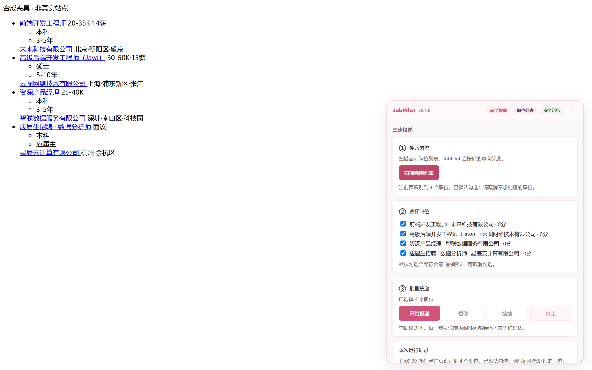
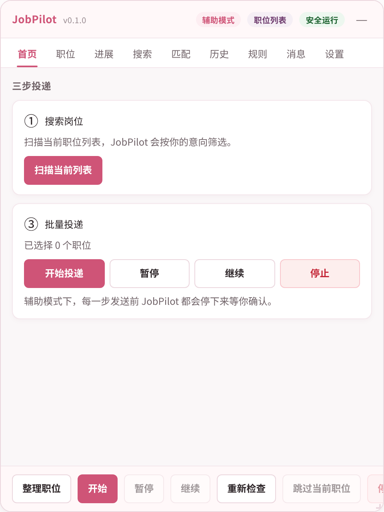
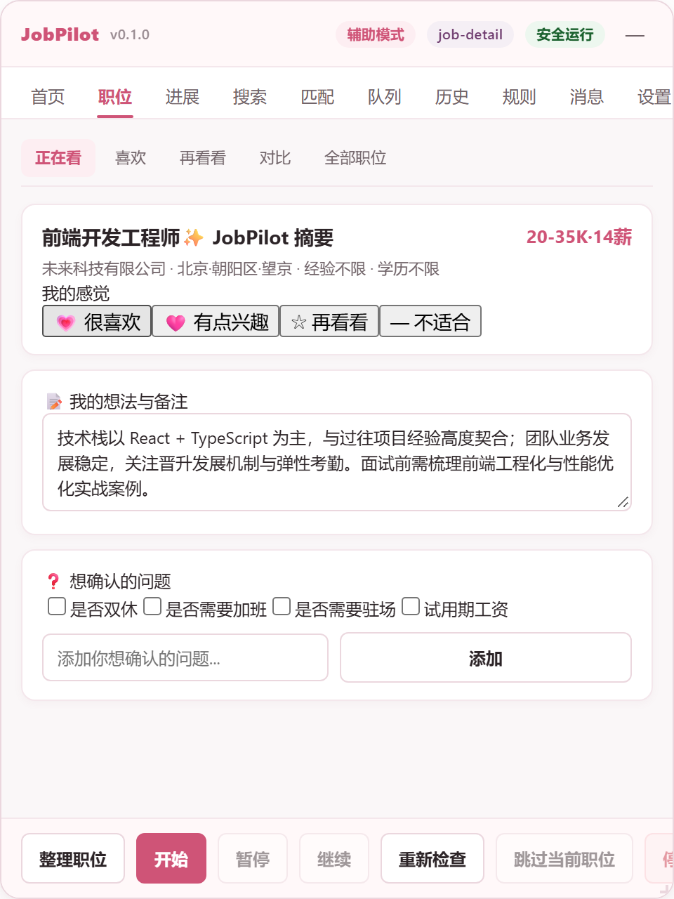
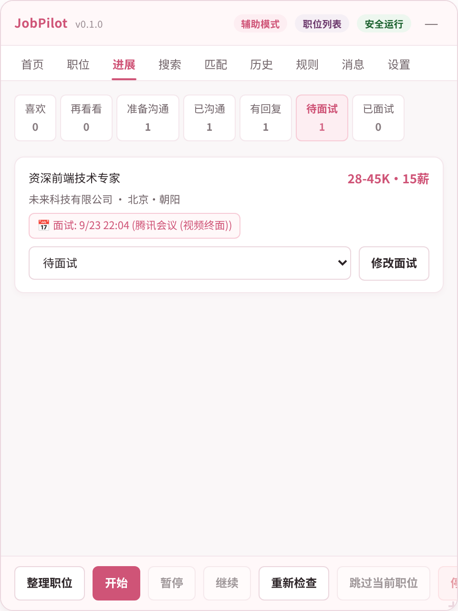

# JobPilot

A local-first, rule-driven job-application assistant that runs as a userscript in
your own browser tab.

JobPilot reads the job listings already rendered in front of you, scores them
against rules you write, explains every decision, and — if you explicitly ask it
to — contacts recruiters on your behalf. It runs entirely inside the page you
opened. There is no server, no account, and no telemetry: the configuration
schema contains a `telemetryEnabled` field that is hard-defaulted to `false` and
has no code path that turns it on.

> ### 致我的至爱：不要担心工作
>
> 找工作的过程难免会有焦虑与疲惫，但请放宽心，慢慢来。  
> JobPilot 是为你量身定制的温柔助手：它安安静静地替你过滤繁杂信息、整理心仪机会、记录求职笔记，把求职的节奏稳稳交还给你。  
> 无论何时，不要有压力，做你自己，最好的机会一直在前方向你走来。

---

## 界面与工作台预览

JobPilot 采用柔和温暖、低压力的设计风格，原生嵌入 BOSS 直聘浏览体验，助你在从容、自主的节奏中管理求职全流程：

| **BOSS 原生嵌入浏览** | **从容低压的求职主页** |
| :---: | :---: |
|  |  |
| *悬浮于页面右上角，阴影隔离，不干扰原生页面操作* | *舒缓问候语、轻量探索引导与今日求职动态小结* |

| **职位伴侣与私密笔记** | **求职全流程进展看板** |
| :---: | :---: |
|  |  |
| *自动提取亮点、主观偏好标记、私密笔记自动保存与提问清单* | *全阶段流转看板（准备沟通、已沟通、待面试、Offer）与面试排程* |

---

## Status

JobPilot is a working, tested program whose interaction with the **real BOSS
Zhipin site is unverified**. That distinction matters more than any feature list,
so it comes first.

| Area | Status | Detail |
| --- | --- | --- |
| Domain rules, scoring, two-stage matching | **Verified** | Pure TypeScript, covered by unit tests under `tests/unit/domain`, `tests/unit/matching` |
| Config schema, validation, migrations v1→v2→v3→v4 | **Verified** | Unit-tested in `tests/unit/config` |
| State machine (reducer + effects) | **Verified** | `tests/unit/application/state-machine.test.ts` |
| Application history / dedup | **Verified** | `tests/unit/application/history.test.ts`, `tests/unit/history` |
| Storage adapters (GM + in-memory) | **Verified** | `tests/unit/storage/storage.test.ts` |
| Communication transaction (intent phases) | **Verified as logic** | `tests/unit/communication/intent.test.ts` |
| Communication transaction persistence | **Verified** | The intent is written through storage on every change and recovered on boot (`tests/unit/application/repository.test.ts`). A recovered `send-attempted` transaction is resolved by verification only |
| Execution queue | **Verified and shipped** | `tests/unit/infrastructure/infrastructure.test.ts`; populated from accepted matches and rendered in the Queue tab |
| Communication runner (drives a send) | **Logic verified; not yet driven by the queue** | `tests/unit/application/communication-runner.test.ts`, including composition tests against the adapter's real guard. Bootstrap constructs it and uses it to settle a recovered transaction, but the queue does not yet call `run()` for new sends; see "Known limitations" |
| Cross-tab execution lock | **Wired and unit-tested** | `src/adapters/userscript/navigator-lock.ts`, acquired in `bootstrap.ts`. Tested against a spec-accurate async `LockManager` fake, not against two real browser tabs |
| Panel mounting, shadow DOM isolation, fail-closed on a CAPTCHA page | **Verified in Chromium** | `tests/browser/` against local fixtures, driving the built bundle |
| **BOSS adapter: page classification** | **Fixture-only** | `tests/integration/boss-page-detection.test.ts`. Recognises *our synthetic HTML*, not the live site |
| **BOSS adapter: list/detail parsing** | **Fixture-only** | `tests/integration/boss-parser.test.ts`. Same caveat |
| **BOSS adapter: applying to a job** | **Fixture-only + unverified selectors** | `tests/unit/...` and fixtures only. The live apply flow was never observed |
| **BOSS adapter: sending a message** | **Fixture-only + unverified selectors** | The real chat DOM, send button, success dialog and failure markers were never inspected |
| **BOSS city code table** | **Vendored, not verified live** | Derived from a public MIT-licensed table (374 entries); not confirmed against BOSS's own API |

**The real BOSS Zhipin DOM was never inspected while writing the BOSS adapter.**
Every selector in `src/adapters/boss/selectors.ts` carries a `confidence` field
that is either `fixture-only` or `unverified` — there is no `verified` value in
the type. `BOSS_METADATA.automationVerified` is the literal `false`, typed as a
literal so that a false claim cannot be made to compile.

A passing test suite proves the parser plumbing works. It proves nothing about
whether JobPilot recognises the live site — the fixtures were hand-authored to
match the selectors, not captured from the site.

Do not install this expecting it to work on BOSS Zhipin today. Do install it if
you intend to help verify it. See [`docs/boss-adapter.md`](docs/boss-adapter.md).

### Live-testing status

**No live scenario has been run yet.** The staged plan and its hard gates are in
[`docs/live-testing/TEST_MATRIX.md`](docs/live-testing/TEST_MATRIX.md), the
procedure is in [`docs/live-testing/RUNBOOK.md`](docs/live-testing/RUNBOOK.md),
and per-scenario progress is tracked in
[`docs/live-testing/PROGRESS.md`](docs/live-testing/PROGRESS.md).

Two things that are worth stating plainly, because they are what a reader
actually needs to know:

- The diagnostic build is **ready for live testing**. `pnpm diag:selftest`
  proves the observation → export → analysis loop closes: it drives the real
  instrumenters, exports a real bundle, analyses it offline, and asserts the
  bundle carries route, page-fingerprint, state, effect, selector, queue,
  storage, transaction, chat-identity and verification traces. That gate does
  not touch BOSS and does not prove anything about it.
- Passing automated tests is **not** evidence of live-site behaviour. It is
  evidence that the code is internally consistent. The distinction is the whole
  reason the staged live-testing plan exists.

A stable `v1.0.0` will not be published until the required live scenarios have
actually passed. Until then the honest description of this project is: a
well-tested userscript whose real-site behaviour is unverified.

---

## Features

**Personal job workspace & companion**

- Native companion view (`正在看`): automatically extracts and highlights core
  job criteria, perks, potential concerns, and salary details from the active posting.
- Subjective feeling tags: record your personal attitude (`很喜欢` / `有点兴趣` /
  `再看看` / `不适合`) with zero cognitive pressure.
- Private note-taking: autosaved personal impressions, team notes, and interview thoughts
  stored locally with debounce and visual confirmation.
- Inquiry checklist: preconfigured and customizable questions to ask recruiters (e.g.
  work-life balance, overtime expectations, team size, probation terms).
- Multi-bucket collection: quick access to favorites, considering list, side-by-side
  job comparison table, and archived opportunities.

**Recruitment pipeline & interview tracker**

- Full-funnel progression: tracks opportunities across stages (`准备沟通` → `已沟通` →
  `有回复` → `待面试` → `已面试` → `收到 Offer` → `已结束`).
- Interview schedule manager: tracks interview timestamps, formats (online video,
  phone, onsite), meeting rooms/locations, and preparation notes.
- Quick stage-mover: effortlessly advance or adjust candidates directly from cards.

**Local-first persistence & backup center**

- Dual storage architecture: GM storage for user configuration and state machine invariants;
  client-side IndexedDB (`jobpilot_workspace_db`) for comprehensive workspace data.
- Absolute privacy: zero outbound telemetry, zero remote tracking; all private notes,
  ratings, and search sessions never leave your local browser.
- Data management: one-click JSON backup export, backup import with safety verification,
  temporary data pruning, and complete local purge controls.

**Discovery and evaluation**

- Search profiles: named, reusable sets of keywords, cities, salary band,
  experience and degree requirements.
- Two-stage evaluation. Stage A filters on card data alone, so a rejected job
  never costs a navigation. Stage B opens only survivors and reads the full
  posting.
- City validation. A city name resolves against a vendored 374-entry BOSS code
  table or discovery refuses to start. There is no default city — an unknown name
  fails explicitly with suggestions.
- Every accept and reject carries an ordered rule trace. There is no score
  without reasons.

**Execution**

- A visible queue with per-item control: pause, resume, skip, stop after this.
- An explicit automation mode ladder: `manual` → `assist` (default) →
  `automatic`. Switching to `automatic` requires an explicit risk
  acknowledgement that the validator enforces — a hand-edited config file cannot
  quietly enable it.
- Session, hourly and consecutive-failure limits, checked when an action is
  armed rather than when it is clicked.
- A watchdog that pauses the machine if a state stalls past its budget.

**Communication transaction**

- Sending a first message is modelled as a persisted transaction with an explicit
  `send-attempted` point of no return.
- Chat identity is verified before anything is typed: a job-id match is
  authoritative, otherwise the title plus the company or recruiter is required. A
  bare editor never authorises a send.
- Success is only ever reported from an observed outgoing-message delta. A
  clicked button is not evidence.

**Persistence**

- One storage key, `jobpilot:root:v1`, namespaced `jobpilot:` so it cannot
  collide with another userscript.
- A versioned schema with real migrations (v1→v2→v3→v4), each additive. Unknown
  fields are carried through; a document claiming a newer version is refused
  rather than downgraded and guessed at.
- History is authoritative: a job that reached `submitted` or `verified` cannot
  transition back to a pre-submission state.

**Interface**

- A panel in an open shadow root, so the host page's CSS cannot reach in and
  JobPilot's cannot leak out.
- Blocked states replace the panel body with a plain-language explanation, the
  reason in the largest text on screen, and a Resume control.
- An `uncertain` send is a first-class state with a dedicated badge. It is never
  rounded to success and never auto-retried.

---

## Safety model

These are design invariants, not settings. They are enforced in the domain and
application layers and are covered by tests.

| Invariant | Where it lives |
| --- | --- |
| **Never bypasses CAPTCHA, risk control or login.** No code path dismisses, solves, retries through or navigates around a verification page | `src/adapters/boss/guards.ts`; `UNSCANNABLE_PAGES` in `src/application/orchestrator.ts` |
| **Fails closed.** An unrecognised page is `unknown`, not a guess. An unmatched apply button is `selector-missing`, with no text-based fallback | `src/adapters/boss/parser/page-kind.ts`, `src/adapters/boss/actions/apply-action.ts` |
| **Never sends into an unverified chat.** Identity must be confirmed from a job id, or a title plus company/recruiter. `insufficient` evidence is treated exactly like a mismatch | `src/domain/communication/identity.ts` |
| **Never overwrites a draft.** A non-empty editor is reported and left untouched, and the check runs again immediately before the click | `prepareMessage` / `dispatchSend` in `src/adapters/boss/communication/communication-action.ts` |
| **Never clicks twice.** `sendAttemptedAt` records the runner committing; `clickDispatched` records the adapter actually clicking. `mayDispatchClick` permits exactly one click per transaction, and it is persisted, so a reload cannot replay it | `src/domain/communication/intent.ts` |
| **Never infers success.** An unconfirmed click is `needs-confirmation`; an unobserved message is `uncertain`. Neither is ever `submitted` / `verified` | `readApplyEvidence`; `observeSend` |
| **Prefers a false skip over a duplicate send.** Five independent dedup layers; if the platform's own state is ambiguous, the job is skipped and labelled as assumed-contacted so you can override deliberately | `src/application/orchestrator.ts`, `src/application/history.ts`, `src/application/discovery.ts` |
| **Yields to the user.** A draft, a route change, or a control the user touches interrupts automation rather than competing with it | `PAGE_CHANGED` and `DRAFT_DETECTED` transitions |

JobPilot deliberately does **not** do any of the following, all of which appear
in comparable tools: connect over the Chrome DevTools Protocol, reuse or copy a
browser profile, deobfuscate anti-scraping fonts, call undocumented in-page APIs,
or optimise for being "harder to flag as automated traffic". See
[`docs/research/boss-reference-analysis.md`](docs/research/boss-reference-analysis.md)
for the reasoning, including which ideas were adopted and which were explicitly
rejected.

This list binds **the shipped userscript**. There is exactly one place in the
repository where an exception exists, and it is maintainer-only development
tooling: `scripts/recon/live-dom-recon.ts` (`pnpm recon:dom`) launches Camoufox,
a Firefox-based automation browser, to *read* the real DOM so selector updates
can be evidence-backed. It never ships, never runs in CI, performs no writes on
the site (no clicks into conversations, no typing, no sends), and its captures
stay under gitignored `test-results/`. If you install JobPilot, none of this
runs on your machine. See
[`docs/development.md`](docs/development.md) §3.1.

**You are responsible for how you use this.** Unattended messaging may violate a
platform's terms of service. The `automatic` mode exists because some users
accept that trade-off knowingly; the default is `assist`, which does not send
without a human.

---

## Installation

JobPilot is not published to any userscript registry. Build it and load the
built file.

```bash
git clone <repository-url> jobpilot
cd jobpilot
pnpm install
pnpm build
```

`pnpm build` writes exactly one runtime file, `dist/jobpilot.user.js`. It also
nests a copy under `dist/<name>/` because of how pnpm resolves the userscript
manifest; `dist/jobpilot.user.js` at the top level is the one to install.

Then, with Tampermonkey or Violentmonkey installed:

1. Open the extension's dashboard.
2. Choose **Create a new script** (Tampermonkey) or **Create a new script**
   (Violentmonkey) and clear the template.
3. Paste the contents of `dist/jobpilot.user.js`.
4. Save, then reload a `zhipin.com` tab.

Alternatively, drag `dist/jobpilot.user.js` onto the browser window and accept the
install prompt.

The userscript header requests four grants and nothing else — `GM_getValue`,
`GM_setValue`, `GM_deleteValue`, `GM_registerMenuCommand` — and matches only
`https://www.zhipin.com/*` and `https://zhipin.com/*`. `pnpm verify:dist` fails
the build if either set grows.

If the GM storage APIs are unavailable (for example when you load the file as a
plain script during development), JobPilot falls back to in-memory storage and
logs a warning. The panel still works; nothing survives a reload.

---

## Development

Requires **Node `^20.19.0 || >=22.12.0`** and **pnpm 11** (the exact version is
pinned in `package.json`'s `packageManager` field). See
[`docs/development.md`](docs/development.md) for the full workflow.

```bash
pnpm install          # install dependencies
pnpm dev              # Vite dev server with HMR for the userscript bundle
pnpm check            # the full gate: typecheck, lint, test, build, verify:dist
```

Quality gates, individually:

```bash
pnpm typecheck        # tsc --noEmit over tsconfig.json and tsconfig.node.json
pnpm lint             # biome check .
pnpm format           # biome format --write .  (moves files, does not fail)
pnpm test             # vitest run: unit + integration, no browser needed
```

---

## Build

```bash
pnpm build            # vite build -> dist/jobpilot.user.js
pnpm verify:dist      # asserts the artifact is installable and safe to ship
```

`pnpm verify:dist` runs `scripts/verify-build.ts`, which checks that the artifact
exists, that the `==UserScript==` block has every required field, that
`@version` matches `package.json`, that `@grant` is exactly the least-privilege
set, that `@match` stays inside `zhipin.com`, that there is no `@require`,
`@resource` or `eval(`, that exactly one runtime file was emitted, that no bare
module import or external stylesheet survived bundling, and that the artifact is
within a 4 KiB – 512 KiB size budget.

---

## Architecture

JobPilot is hexagonal. Dependencies point inward; the domain knows nothing about
the DOM, storage or the browser.

```
              ┌─────────────────────────────────────────┐
              │                  UI                     │
              │        src/ui/panel.ts, sections.ts     │
              └────────────────────┬────────────────────┘
                                   │ view models + callbacks
                                   v
              ┌─────────────────────────────────────────┐
              │             APPLICATION                 │
              │  controller · reducer · orchestrator    │
              │  state · events · discovery · history   │
              └────────────────────┬────────────────────┘
                                   │
                                   v
              ┌─────────────────────────────────────────┐
              │                DOMAIN                   │
              │  rules · engine · matching · job ·      │
              │  communication/intent · application     │
              └─────────────────────────────────────────┘
                     ^                          ^
                     │ implements               │ implements
              ┌──────┴───────┐           ┌──────┴────────┐
              │   ADAPTERS   │           │ INFRASTRUCTURE│
              │ boss · storage│          │ logs · observer│
              │              │           │ queue · retry  │
              └──────┬───────┘           └──────┬─────────┘
                     │                          │
                     └────────────┬─────────────┘
                                  v
                         ┌─────────────────┐
                         │      PORTS      │
                         │ JobPlatform ·   │
                         │ Storage · Lock ·│
                         │ Logger          │
                         └─────────────────┘
```

The rules, in full:

- **UI → Application → Domain.** The panel renders view models it is handed and
  reports user intent through callbacks. It never reaches into automation,
  storage or an adapter.
- **Adapters → Ports ← Application.** An adapter implements a port the
  application depends on. The application never imports an adapter.
- **`src/bootstrap/container.ts` is the only composition root.** It is the single
  place where concrete adapters are constructed and wired.

Adding a platform means adding an adapter. It never means changing the domain,
the state machine, the queue or storage. Full module inventory, the reducer's
effect model, the persistence schema and the multi-tab lock design are in
[`docs/architecture.md`](docs/architecture.md).

---

## Configuration

Configuration is a single versioned document stored under `jobpilot:root:v1`.
There is no settings file to edit by hand, though the persisted JSON is
hand-editable and is validated on every load.

**The mode defaults to `assist`.** `DEFAULT_AUTOMATION_MODE` in
`src/config/schema.ts` carries a comment telling you not to change it, and the
validator refuses `mode: "automatic"` unless `acknowledgeRisks` is `true`.

| Section | What it controls |
| --- | --- |
| `general` | Master `enabled` switch, `locale`, `enabledPlatforms`, `pauseOnNavigation` |
| `filters` | Hard filters: cities, salary bounds, education, experience, include/exclude keywords, company blacklist, `excludeOutsourcing`, `excludeHeadhunter`, `skipProcessed` |
| `scoring` | `baseScore`, `acceptThreshold`, `maxScore`, and weighted keyword lists for titles, descriptions, skills and cities |
| `automation` | `mode`, `acknowledgeRisks`, per-session and per-hour caps, `maxRetries`, action delay range, `verifyAfterSubmit`, `stopOnUnknownDom` |
| `rateLimit` | `minNavigationDelayMs`, `failureBackoffMs`, `maxConsecutiveFailures`, `stopOnCircuitBreak` |
| `ui` | `showPanel`, `panelPosition`, `showReasons`, `compactMode` |
| `logging` | `level`, ring-buffer `maxEntries`, `persistLogs`, and the reserved `telemetryEnabled` |

Migration policy: migrations are **additive and never destroy user data**. A
document with no `schemaVersion` is treated as v1. A document claiming a version
newer than this build supports is refused outright and left on disk untouched,
because downgrading by guessing would drop fields the current build cannot see.

---

## Testing

```bash
pnpm test              # vitest run — unit + integration (happy-dom + Node, no browser)
pnpm test:unit         # vitest run tests/unit
pnpm test:integration  # vitest run tests/integration
pnpm test:browser      # playwright test — requires a build first
```

`pnpm test:browser` drives the **built** userscript (`dist/jobpilot.user.js`) in
Chromium, so run `pnpm build` first. It needs Playwright's browser once:

```bash
npx playwright install chromium
```

Browser tests run against a loopback fixture server (`tests/browser/server.mjs`
on `127.0.0.1:43117`). They never touch the live site. The harness is served from
`http://www.zhipin.com:43117` with `--host-resolver-rules=MAP www.zhipin.com
127.0.0.1`, which makes `location.hostname` genuinely `www.zhipin.com` while
resolving before DNS — so the production host guard runs unmodified, and no
packet leaves the machine. `fixture-smoke.spec.ts` installs a request listener
that fails the suite if any request targets a non-loopback host.

| Suite | Covers |
| --- | --- |
| `tests/unit/` | Domain rules, matching, config validation and migrations, the reducer, history, storage, the intent machine, the communication runner, identity matching |
| `tests/integration/` | The BOSS adapter against synthetic fixtures in happy-dom: page classification and list/detail parsing |
| `tests/browser/` | The built bundle in Chromium: panel mount and isolation, page-kind chip, and the fail-closed guarantee that Start on a CAPTCHA page dispatches zero events |

---

## Known limitations

These are real and current.

1. **No live-site verification.** The BOSS adapter has never been run against
   the real BOSS Zhipin DOM. Roughly one in three selectors is an outright guess.
   See [`docs/boss-adapter.md`](docs/boss-adapter.md).
2. **Only one platform.** BOSS Zhipin. The port is designed for more; there is
   one implementation.
3. **Apply flows are not driven end to end in a browser test.** No browser spec
   completes a real apply; the safety specs assert that JobPilot does *nothing*
   on a blocked page.
4. **Interactive tabs are fully built; live automated messaging remains unlinked.**
   All eleven panel sections (Home, Workspace, Pipeline, Search, Matches, Queue, History, Rules,
   Messages, Settings, Diagnostics) are live and interactive. Unattended end-to-end messaging
   via queue trigger remains intentionally gated until live-site verification is completed.
5. **Sending is not yet driven by the queue.** The runner
   (`src/application/communication-runner.ts`), the adapter action and the
   intent persistence are all implemented and tested, and bootstrap uses the
   runner to settle a transaction recovered from a previous page. But the queue
   does not call `run()` for new sends, so no message is composed and sent end
   to end today. The transaction machinery is exercised by tests and by the
   recovery path, not by a full send.
6. **The "uncertain send" decision list is a placeholder.** It derives from
   history records with status `submitted` rather than from the persisted
   `CommunicationIntent`, which now exists but is not yet surfaced there.
7. **Multi-tab locking is wired but not verified in a real browser.** The
   `navigator.locks` adapter is acquired in `bootstrap.ts` and Start/Discover
   are refused without ownership, but it has only been tested against a fake
   `LockManager`, never against two live tabs.
8. **Recruiter activity parsing is conservative and often yields `unknown`.**
   Contradictory labels resolve to the least-active state, and the container
   selectors are unverified heuristics, so `unknown` is common in practice.
9. **An unreadable document puts JobPilot into read-only mode.** If the stored
    data was written by a newer schema version, JobPilot refuses to migrate it
    `and refuses to save`, so an intact document is never overwritten by
    defaults. The trade-off is that nothing persists until you clear the
    document or run a build that understands it.
10. **City codes are vendored, not fetched.** If BOSS changes its taxonomy the
   table goes stale silently; nothing checks it against the site.
11. **No telemetry, and therefore no crash reporting.** Diagnostics stay in the
    browser. If something fails on the live site, only your own logs will say so.

---

## Roadmap

Ordered by what most increases confidence in the thing that is currently
unverified.

1. **Verify selectors against the real site**, capture by capture, promoting each
   entry out of `fixture-only`/`unverified` with cited evidence. This is the only
   work that can move `automationVerified` off `false`.
2. **Drive sends from the queue.** The runner, adapter action and intent
   persistence all exist; the remaining step is for the queue to call `run()`
   for a selected job, which is what would make a full send reachable.
3. **Build the Rules, Messages and Settings panels.** Discovery, Matches and
   Queue are live; these three tabs still render explanatory text.
4. **Verify multi-tab ownership in two real browser tabs.** The lock is
   implemented and acquired at boot; only a fake `LockManager` has exercised it.
5. **Drive a full apply and a full send in a browser test** against fixtures.
6. **A second platform adapter**, to prove the port boundary is real.
7. **Import from BOSS Helper settings**, non-destructively, with a field-by-field
   review before anything is written.

---

## License

MIT. See [`LICENSE`](LICENSE).
